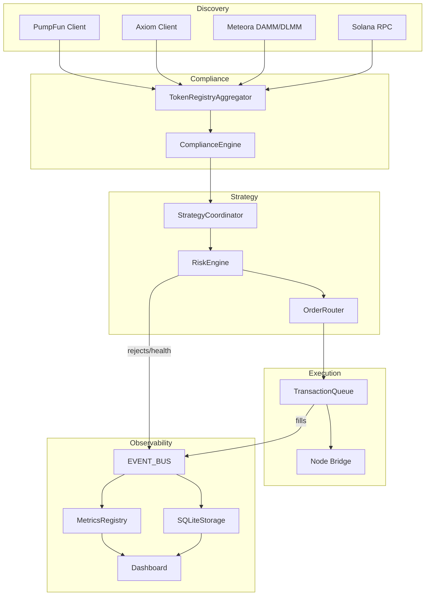

# Agents and Service Responsibilities

This repository organises functionality into loosely coupled agents. Each component advertises a clear contract and surfaces
metrics/events so the orchestration layer can react deterministically.

## Discovery & compliance

| Agent | Inputs | Outputs | Failure modes | Runbook |
| --- | --- | --- | --- | --- |
| `DiscoveryService` | Axiom/PumpFun APIs, Meteora registries, Solana RPC | `TokenUniverseEntry` catalogue, liquidity events | Upstream API outages, RPC rate limits, malformed token metadata | Retry with exponential backoff (built-in), failover to cached universe (`_universe_cache`), audit logs via event bus |
| `TokenRegistryAggregator` | Discovery results, on-chain stats, price oracle | Risk metrics, token controls, compliance flags | Invalid pool data, stale oracle prices, schema migrations | Re-run ingestion with `--limit` to rebuild cache, inspect `token_controls` table, adjust `token_universe` thresholds |
| `ComplianceEngine` | Token metadata, on-chain stats, configured deny lists | `ComplianceFinding` objects appended to risk flags | Misconfigured deny lists, false positives on social keywords | Review `config/app.toml` entries, whitelist via `TokenControlService`, monitor `/api/token-controls` dashboard view |

## Strategy & execution

| Agent | Inputs | Outputs | Failure modes | Runbook |
| --- | --- | --- | --- | --- |
| `StrategyCoordinator` | Feature scores, universe entries, risk engine | Ordered `StrategyDecision` list | Strategy exceptions, cooldown saturation, risk rejection | Inspect logs via correlation ID, replay dry-run with deterministic seed, adjust `StrategyConfig` priorities |
| `RiskEngine` | Decisions, exposures, PnL snapshot | Approval or throttle result, kill-switch events | Oracle staleness, breach of global limits, repeated rejects | Validate RPC health, review Prometheus `risk_rejection_rate`, engage manual kill switch (`RiskEngine.engage_kill_switch`) |
| `OrderRouter` | Decision, token universe entry | Ranked `RoutingDecision` per venue | Venue adapter failure, stale pool cache, slippage drift | Switch to dry-run mode, inspect `/api/router-decisions`, refresh Meteora caches |
| `TransactionQueue` | Approved decisions, wallet signer | Persisted transaction plans, fill events | RPC submission failures, queue saturation, recovery backlog | Increase `execution.queue_capacity`, drain `*.queue.json` state, monitor `transaction_queue_depth` gauge |

## Observability & analytics

| Agent | Inputs | Outputs | Failure modes | Runbook |
| --- | --- | --- | --- | --- |
| `EVENT_BUS` | Structured events from strategies, execution, risk | Fan-out to metrics, storage, alerts, WebSocket listeners | Subscriber exceptions, SQLite backpressure, alert webhook outage | Check `/api/events`, review `metrics.events.*` counters, validate alert endpoints via `AlertManager.send` |
| `PnLEngine` | Fill events, price oracle, positions | Real-time PnL, exposure map, metrics snapshots | Oracle failures, missing token metadata, negative inventory | Backfill token metadata (`storage.upsert_token`), verify oracle endpoints, run `pnl.snapshot(persist=True)` manually |
| `MetricsRegistry` | Counter/gauge/histogram observations | Prometheus exposition, dashboard snapshot | Unbounded histogram growth, stale gauges | Call `MetricsRegistry.reset()` in diagnostics, adjust histogram sample limit, scrape `/metrics` to confirm |
| `DashboardState` | SQLiteStorage, MetricsRegistry, EventBus | JSON responses for UI & API | Slow disk I/O, listener leaks, authentication drift | Inspect SQLite pragmas, prune listeners via `DashboardState.remove_listener`, rotate tokens |

## Data flow overview

## Incident response cheat sheet

1. **High reject rate** – confirm `risk_rejection_rate` gauge, review `/api/token-controls` for automated pauses, inspect risk
   reasons emitted with `EventType.REJECT`.
2. **Stale metrics** – verify `metrics_snapshots` table is updating; if not, check `PnLEngine.snapshot` logs and ensure the trading
   loop is running.
3. **Event bus backlog** – watch `events.*` counters and queue depth. If saturated, increase `event_bus.max_queue_size` and audit
   subscriber handlers for blocking logic.
4. **Dashboard authentication failure** – rotate `DASHBOARD__READ_ONLY_TOKEN`, confirm the FastAPI instance was restarted, and
   ensure any reverse proxy forwards the header to the upstream server.

> **Reminder:** Profitability depends on execution discipline and fast reaction to market microstructure. Automated agents help
> scale decision-making, but human oversight remains mandatory.
